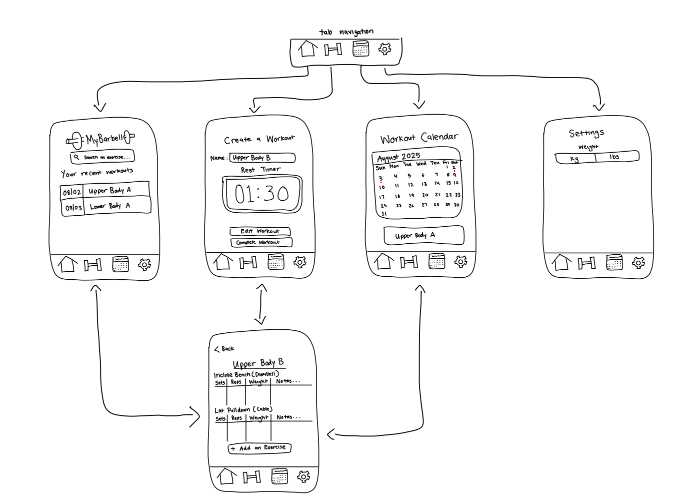

iOS101 Capstone Project - README
===

# MyBarbell

## Table of Contents

1. [Overview](#Overview)
2. [Product Spec](#Product-Spec)
3. [Wireframes](#Wireframes)

## Overview

### Description

**MyBarbell** allows experienced and inexperienced people to search for exercises and track the weight, number of sets, and reps done. Personal bests (PBs) are also remembered, so that when the user surpasses their PB, they are notified of their achievement. There is also a rest timer that allows for the amount of rest the user allows themselves to be tracked.

### App Evaluation

- **Category:** Health & Fitness
- **Mobile:** Mobile is essential for the instant logging of execises done by the user. Users can easily set a timer and get a push notification when the rest timer is up.
- **Story:** Creates discipline for inexperienced and experienced users. Allows progression to not go unnoticed and is a reliable easy to use alternative to competitors.
- **Market:** Any person who has experience exercising or wants to get into exercising. 
- **Habit:** Both experienced and inexperienced people will use this app daily to be ontop of their goals and progression.
- **Scope:** V1 would allow users to access a variety of exercises to choose from. V2 would incorporate a UI to track sets, reps, and weight of a selected exercise along with a timer. V3 would add a way for users to see previous workouts done via a calendar. V4 would incorporate a way to connect with user's friends.

## Product Spec

### 1. User Stories (Required and Optional)

**Required Must-have Stories**

* User can search for exercises
* User can create new workout
* User can see previous workouts
* User can log exercises done during workout
* User can track the weight used, number of sets, and number of reps done during the exercise
* User can set a timer to track the amount of rest after each set

**Optional Nice-to-have Stories**

* User can see days active via a calendar
* User can add friends and comment on one another's workout/progress
* User can rank up via the ranking system
* User can switch between kg/lbs

### 2. Screen Archetypes

**1. Stream**
* User can search for exercises
* User can see previous workouts

**2. Detail**
* User can log exercises done during workout
* User can track the weight used, number of sets, and number of reps done during the exercise

**3. Creation**
* User can create new workout
* User can set a timer to track the amount of rest after each set

**4. Settings**
* User can switch between kg/lbs

**5. Calendar**
* User can see days active via a calendar

### 3. Navigation

**Tab Navigation** (Tab to Screen)

* Home Feed
* Create a Workout
* Calendar
* Settings

**Flow Navigation** (Screen to Screen)

**1. Stream Screen**
* => Detail

**2. Detail Screen**
* => Stream
* => Create
* => Calendar

**3. Creation Screen**
* => Detail
* => Stream

**4. Settings Screen**
* => None

**5. Calendar**
* => Detail

## Wireframes

## Features implemented
- [x] Logo & Color Scheme
- [x] Basic UI
- [x] Basic Timer
- [x] Screens & Tab Navigation

## Features to be implemented
- [ ] Searchable Exercises
- [ ] Logging of sets, reps, and weight
- [ ] Calendar View
- [ ] Setting Weight Unit Toggle

## Video Walkthrough

    
    
  
